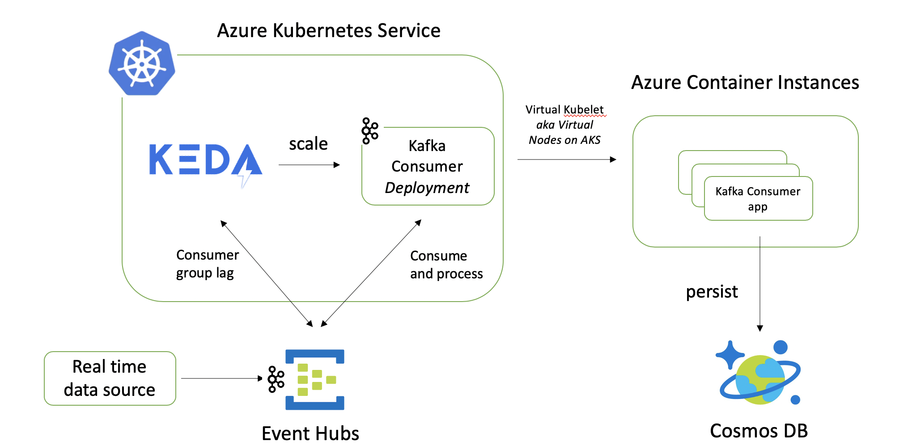

Real-time, horizontally scalable data processing application in a Serverless way.

## Solution overview



A simple order processing application.

Application components:

- Producer app - Go app that sends simulated orders to Azure Event Hubs Kafka endpoint. Uses Sarama Kafka client
- Order processor - A Java app that receives order events from Event Hubs and stores them to Azure Cosmos DB. It uses Kafka Java API and Azure Cosmos DB Java SDK v4. Runs in Kubernetes as a `Deployment`

Infrastructure components (PaaS)

- Azure Event Hubs Kafka: serves as the ingestion layer (receives orders)
- Azure Cosmos DB (SQL API): uses for persistence (storing processed order data)
- Azure Kubernetes Service (AKS): managed Kubernetes offering

Kubernetes components:

- KEDA: Uses the Kafka scaler to auto-scale Order Processor Deployment. The Kafka scaler works on the basis of topic consumer lag
- Virtual Kubelet: Uses AKS integration for Virtual Kubelet (Virtual Nodes) to spin up Order Processor Pods on Azure Container Instances (ACI) rather than on AKS nodes - ACI provides "serveless" platform and Virtual Nodes integration enables it

## Azure setup

- [Microsoft Azure](https://azure.microsoft.com/free/?WT.mc_id=data-0000-abhishgu) account
- [Create a Kafka enabled Event Hubs namespace](https://docs.microsoft.com/azure/event-hubs/event-hubs-quickstart-kafka-enabled-event-hubs?WT.mc_id=data-0000-abhishgu#create-a-kafka-enabled-event-hubs-namespace)
- [Create Azure Cosmos DB components](https://docs.microsoft.com/azure/cosmos-db/create-cosmosdb-resources-portal?WT.mc_id=data-0000-abhishgu): account, database and container
- [Create AKS cluster with Virtual Nodes (Virtual Kubelet) feature](https://docs.microsoft.com/azure/aks/virtual-nodes-portal?WT.mc_id=data-0000-abhishgu)

## Install KEDA

```bash
helm repo add kedacore https://kedacore.github.io/charts
helm repo update

kubectl create namespace keda
helm install keda kedacore/keda --namespace keda
```

This will install the KEDA Operator and the KEDA Metrics API server (as separate `Deployment`s)

```
kubectl get deployment -n keda

NAME                              READY   UP-TO-DATE   AVAILABLE   AGE
keda-operator                     1/1     1            1           1h
keda-operator-metrics-apiserver   1/1     1            1           1h
```

To check KEDA Operator logs

```bash
kubectl logs -f $(kubectl get pod -l=app=keda-operator -o jsonpath='{.items[0].metadata.name}' -n keda) -n keda
```

## Deploy the solution

We will deploy the consumer (order processor) app first, followed by the KEDA specific components. Start by cloning the repo:

```bash
git clone https://github.com/abhirockzz/kafka-cosmos-keda-vk-aks-sample
cd kafka-cosmos-keda-vk-aks-sample
```

### Deploy order processing (consumer) app

Replace the content in the file `1-secret.yaml` with `base64` encoded values for Event Hubs connection string and Cosmos DB key

Create the `Secret`, followed by consumer app `Deployment`


```bash
kubectl apply -f deploy/1-secret.yaml
kubectl apply -f deploy/3-consumer.yaml

//check consumer app pod
kubectl get pod -l=app=order-processor
```

The `Pod` will actually be created in Azure Container Instances (not AKS), thanks to the Virtual Nodes integration. 

> Check the container in ACI

### Deploy KEDA components

Replace Event Hubs, Cosmos DB and other details in the file `4-kafka-scaledobject.yaml`

We need to create KEDA `TriggerAuthentication` first and then the `ScaledObject`

```bash
kubectl apply -f deploy/2-trigger-auth.yaml
kubectl apply -f deploy/4-kafka-scaledobject.yaml
```

Check HPA - `kubectl get hpa`

> Check Consumer app again (`kubectl get deployment order-processor`) - it will be removed by KEDA (the promise of scale to zero)

## Test the solution...

Check pods auto-scaling

```
kubectl get deployment -l=app=order-processor -w
```

In another terminal, Start producer application - replace the event hubs info in `producer.sh` file.

To run the producer - `./producer.sh`

Check ACI after a while.. you will see container instances spinning up.

Scale down - stop producer app. Wait for a while and the ACI containers will be terminated by KEDA

## Clean up

To [uninstall](https://keda.sh/docs/deploy/#uninstalling-keda) KEDA:

```bash
helm uninstall -n keda keda
kubectl delete -f https://raw.githubusercontent.com/kedacore/keda/master/deploy/crds/keda.k8s.io_scaledobjects_crd.yaml
kubectl delete -f https://raw.githubusercontent.com/kedacore/keda/master/deploy/crds/keda.k8s.io_triggerauthentications_crd.yaml
```

To delete the Azure services, just delete the resource group:

```bash
az group delete --name <AZURE_RESOURCE_GROUP> --yes --no-wait
```